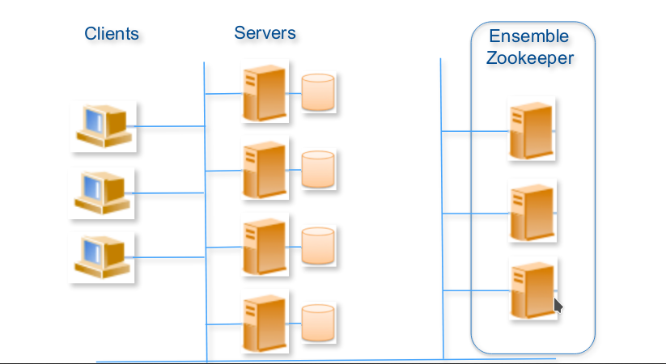
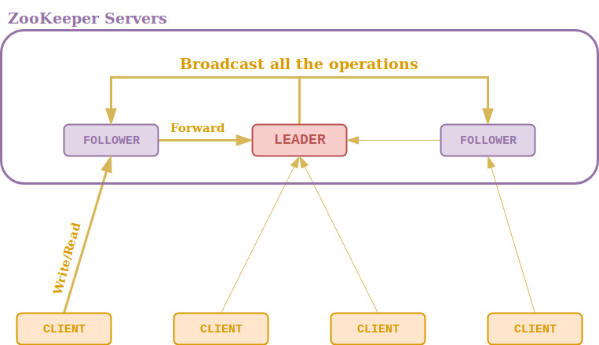
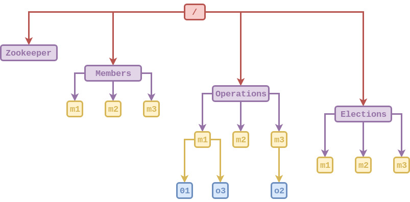

# Bank-Management-with-Zookeeper
 Managements information of the clients in a bank, provide fault tolerance and consistency

The aim of this project is to develop an application for managing the clients of a bank.  The  main goal is  to  develop  an  application  distributed,  in  order  to  provide properties,  such  as  consistency,  fault tolerance,  replication,  and  availability.  

The management of the clients relies on simple features: 

* The register for each client includes  **account** **number**,  **name** and its **balance**.
* Operations:  **create**  a  client,  get  its  **information**,  **update**  its  balance (deposit or withdraw), and **delete** a client. 
* State of the bank: **client list** and its information. 

The following figure describes the overall architecture of the intended system. Clients interacts with a server, which maintains the information in is disk. The Zookeeper ensemble provides the basic means for configuring a membership service, relied on a faults detector, and allowing the servers to ensure the consistency of the operations requested by the clients.

### Consistency
We needed to make sure that every server uses the same state of the database at all times and every operation is executed in the correct order. In order to do that, while read operations can be executed by any server (since they do not change the state of the DB), write operations can only be handled by the leader node of the Zookeeper ensemble. Therefore, if a follower node receives a write request, they have to forward it to the leader node first which executes the operations and informs every follower about completed operations in the form of a broadcast message.

##### Description of the use of ZooKeeper for consistency

The system architecture diagram basically contains all the earlier mentioned approaches and decisions, such as having three servers (fault tolerance, availability) that both handle client requests and participate in the Zookeeper ensemble (fault tolerance, consistency) and executing every operation by the leader only (consistency). 

The structure of ZooKeeper file system will consist of three main nodes, Members in which each server process puts its own information (for example, ip address and port the process is listening on) in its nodes’ data. All these process create an ephemeral node, if that process ever dies or is unreachable its associated node will be deleted. Then we have Operations, in which every member will store information about the various type of operation such as read, write, etc. Finally Elections will be used for handle the leader election. The basic idea is: we have a parent node ‘/elections’, and then have each candidate create an ephemeral sequential child node. The node that gets the lowest sequence id wins and is the new leader. 

